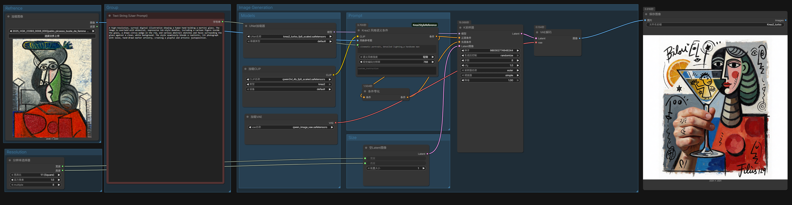

# ComfyUI Krea2 Style Refrence

ComfyUI custom nodes for Krea2 / Krea2 Turbo style semantic conditioning and img2img style fusion.

This package provides two nodes:

```text
Krea2/风格 -> Krea2 风格语义条件
Krea2/风格 -> Krea2 风格融合
```

## 节点作用

`Krea2 风格语义条件` 会把参考图作为视觉语义输入送进 Krea2 / Qwen3-VL 文本编码器：

```python
clip.tokenize(prompt, images=[style_image])
```

节点输出标准 `CONDITIONING`，可以直接接到 KSampler 的正面条件。它不会修改 diffusion model，不会向 latent 序列注入参考图 token，也不会改采样器。

`Krea2 风格融合` 会把 `style_image` 作为风格语义条件，同时把 `target_image` 通过 VAE 编码成 KSampler 的初始 latent。这样可以用目标图保留主体、画面结构和内容，再用参考图提供风格。

这个节点适合参考：

- 色彩 palette
- 材质和纹理
- 笔触、媒介感、图形语言
- 光影和情绪
- 构图节奏

它不是 Krea 官方云端 style adapter，因此不能保证完全复刻参考图风格，也不适合复制参考图主体。

## 安装

推荐使用 ComfyUI Manager 安装：

```text
Manager -> Custom Nodes Manager -> 搜索 Krea2 Style Refrence -> Install
```

也可以手动安装。在 ComfyUI 的 `custom_nodes` 目录执行：

```bash
git clone https://github.com/DocWorkBox/ComfyUI_Krea2_Style_Refrence.git
```

然后重启 ComfyUI。

## 推荐模型

请使用 ComfyUI 可用的 Krea2 / Krea2 Turbo 模型组件。示例工作流使用 Krea2 Turbo 路线，通常需要：

```text
diffusion_models/krea2_turbo_fp8.safetensors
text_encoders/qwen3vl_4b_fp8_scaled.safetensors
vae/qwen_image_vae.safetensors
```

如果你的模型文件名不同，请在工作流里的加载节点中改成你本地实际文件名。

## 示例工作流：文生图风格参考



示例文件位于：

```text
workflows/krea2_style_reference_semantic_example.json
```

基本连接方式：

```text
Load Krea2 Text Encoder -> Krea2 风格语义条件.CLIP
Load Style Reference Image -> Krea2 风格语义条件.风格参考图
Krea2 风格语义条件.条件 -> KSampler.正面条件
```

负面条件可以继续使用普通负面提示词，也可以按示例工作流从语义条件派生一个 zero-out negative conditioning。

Krea2 Turbo 常用采样起点：

```text
steps: 8
cfg: 1.0
sampler: er_sde
scheduler: simple
denoise: 1.0
```

## 示例工作流：图生图风格融合

示例文件位于：

```text
workflows/krea2_style_fusion_img2img_example.json
```

基本连接方式：

```text
Load Krea2 Text Encoder -> Krea2 风格融合.CLIP
Load Qwen Image VAE -> Krea2 风格融合.VAE
Load Style Reference Image -> Krea2 风格融合.风格参考图
Load Target Image -> Krea2 风格融合.目标结构图
Krea2 风格融合.条件 -> KSampler.正面条件
Krea2 风格融合.目标Latent -> KSampler.Latent图像
```

`target_image` 不会进入 CLIP 图像条件；它只通过 VAE latent 保留主体、构图、姿势和空间结构。`style_image` 才是进入 Krea2/Qwen3-VL 图像 token 路径的风格参考图。

图生图融合推荐从这些 `denoise` 起点测试：

```text
0.35-0.45: 更保留 target image 结构
0.45-0.65: 风格融合平衡起点
0.65-0.80: 更强风格化，但会重绘更多内容
```

## 参数说明

| 参数 | 默认值 | 说明 |
| --- | --- | --- |
| `CLIP` | 必填 | Krea2 文本编码器输出。节点依赖支持 `clip.tokenize(..., images=[...])` 的 Qwen3-VL 图像入口。 |
| `风格参考图` | 必填 | 用来提取视觉语义的参考图。建议选择风格明确、主体干扰少的图。 |
| `正面提示词` | 空 | 目标图像内容。这里描述你想生成的主体和场景，不建议重复描述参考图主体。 |
| `语义风格强度` | `轻微` | 通过内置提示词措辞控制参考图影响。可选 `轻微`、`平衡`、`强烈`。这不是采样器数学强度。 |
| `视觉编码分辨率` | `384` | 参考图进入视觉编码前的像素预算。384 更稳，512/768 保留更多细节但更慢、更占显存。示例工作流使用 512。 |
| `自定义风格指令` | 空 | 可选。填写后替代内置强度指令，用于手写更具体的风格迁移要求。 |

`Krea2 风格融合` 额外包含：

| 参数 | 默认值 | 说明 |
| --- | --- | --- |
| `VAE` | 必填 | Krea2/Qwen 图像 VAE，用于把目标结构图编码为初始 latent。 |
| `目标结构图` | 必填 | 图生图融合的结构和内容来源。需要指定输出尺寸时，请在节点前使用 ComfyUI 的 Image Scale / Crop 节点。 |

## 使用建议

- 从 `轻微` 或 `平衡` 开始测试，确认不会破坏主体后再尝试 `强烈`。
- 参考图尽量选择风格清晰、构图简单的图片。
- 正面提示词要明确目标主体，否则模型可能更容易借用参考图内容。
- 如果风格不明显，优先尝试更明确的 `自定义风格指令`，再提高 `视觉编码分辨率`。
- 如果主体被参考图影响太多，降低 `语义风格强度`，并在提示词中强调目标主体。
- 图生图融合时，如果结构丢失，优先降低 KSampler `denoise`；如果风格不明显，再提高 `语义风格强度` 或 `denoise`。

## 开发验证

在节点目录运行：

```bash
python -B -m unittest discover -s tests -p "test_core.py"
```
